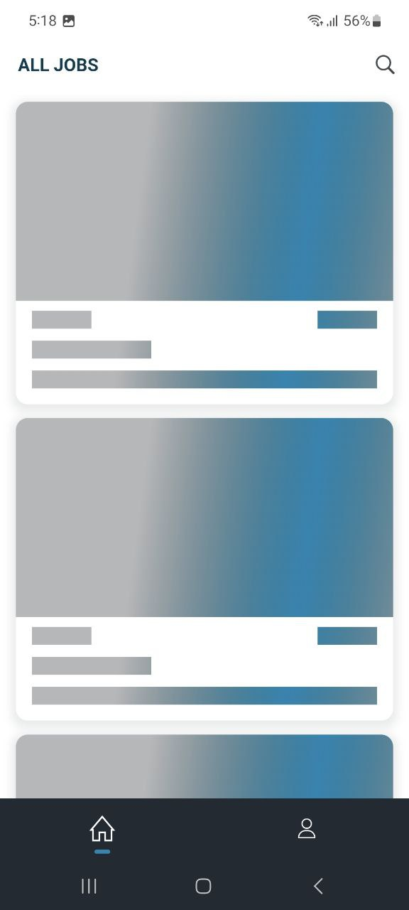
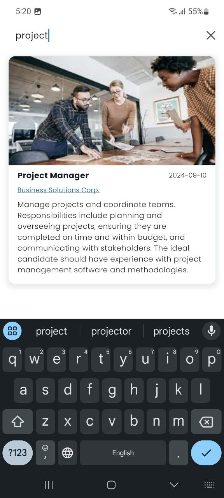
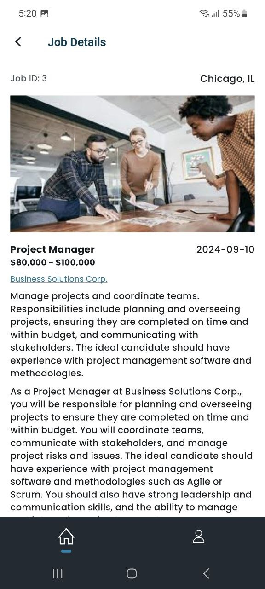
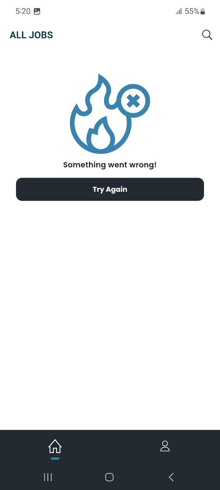
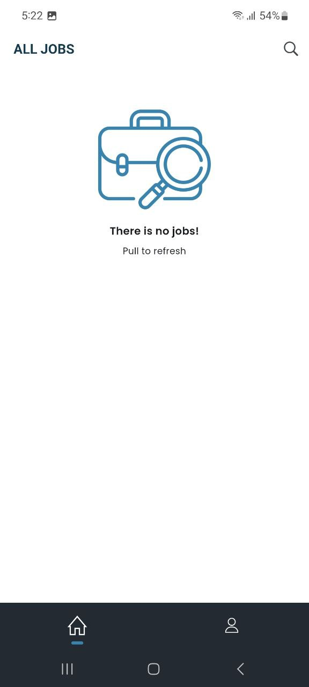

# Jobs App

This repository houses the Flutter codebase for the Jobs mobile app, designed to run on both Android and iOS
platforms. 🚀

## Screenshots

    
    
    
    

     
    
    
<!--      -->

## Frontend

The frontend of the Jobs App is developed using Flutter version 3.22.2. We have adopted the Bloc state management
pattern to efficiently manage the application's state. The separation of concerns (SoC) architecture is employed,
ensuring a clear distinction between the app's logic and presentation layers.

### State Management

The Bloc pattern provides a structured and predictable way to manage the state of the application. It separates the
presentation layer from the business logic, enhancing maintainability and scalability.

### Architecture

The app follows the Separation of Concerns (SoC) principle, where the logic and presentation layers are distinctly
separated. This promotes code organization, making it easier to understand, test, and maintain.

 

Feel free to explore the codebase of the Jobs App app! If you have any questions or feedback, don't hesitate to
open an issue or reach out to us.
